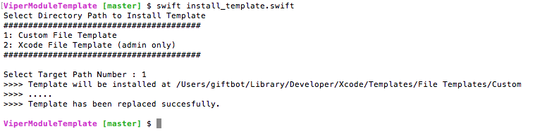
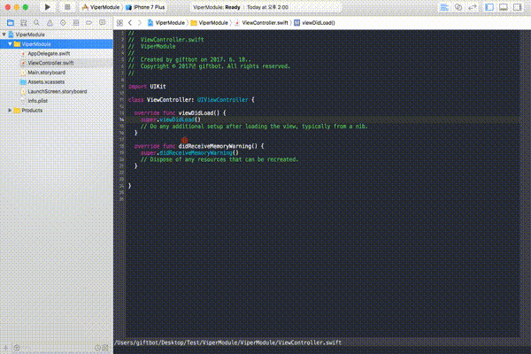

## Viper Module Template

Viper architecture module generator using Xcode template with ease.

- [How to install](#how-to-install)
  - [Using Script](#1-using-script-strongly-recommend)
  - [Manual](#2-manual)
- [Template Usage](#template-usage)


## How to install

### 1. Using script (strongly recommend)

Just execute this command in terminal 

- to install in `User Custom Path`
```shell
swift install_template.swift
```

- to install in `Xcode application Path` 
```shell
sudo swift install_template.swift
```

- ##### ScreenShot
  


### 2. Manual

- to install in `User Custom Path`
```shell
mkdir -p $HOME"/Library/Developer/Xcode/Templates/File Templates/Custom/ViperModule.xctemplate/" && \
cp -R ./ViperModule.xctemplate $HOME"/Library/Developer/Xcode/Templates/File Templates/Custom/"
```
** Copy & Paste above commands ** 
or copy `ViperModule.xctemplate` manually to `$HOME"/Library/Developer/Xcode/Templates/File Templates/Custom"` Directory (File Templates/Custom directory may not exist. It's default)

- to install in `Xcode Application Path` 
```shell
tempDir=`xcode-select -p`"/Platforms/iPhoneOS.platform/Developer/Library/Xcode/Templates/File Templates/Source/" && \
sudo mkdir -p $tempDir/ViperModule.xctemplate/ && \
sudo cp -R ./ViperModule.xctemplate $tempDir
```
or 
Go to Application directory, select 'Show Package Contents' menu of Xcode application icon. Then browse to: `"/Platforms/iPhoneOS.platform/Developer/Library/Xcode/Templates/File Templates/Source/"`. and add `ViperModule.xctemplate` to the directory.


Done. Now you can find viper module template in Xcode.
Congratulations!  🎉🎉

## Template Usage



## License
** Xcode Template Helper ** is under the MIT license. See [LICENSE](LICENSE) for details.